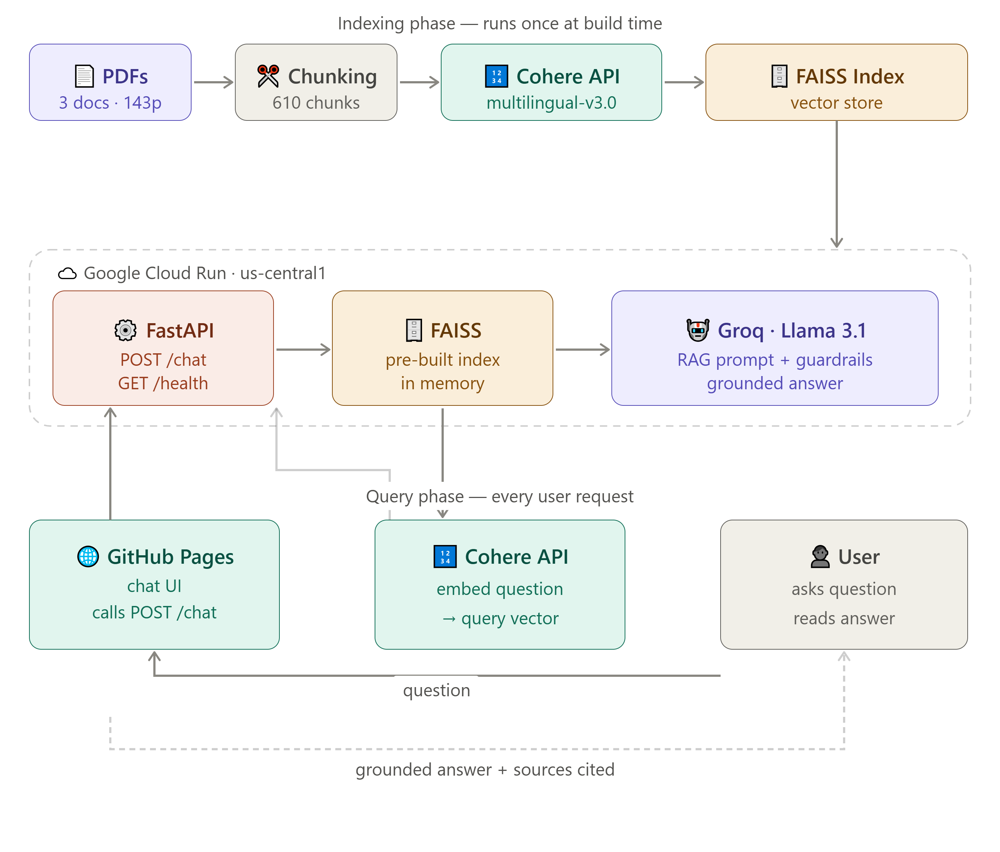
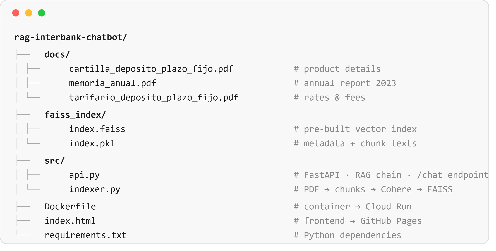

# 🏦 RAG Interbank Chatbot

> AI-powered chatbot that answers questions about Interbank's financial products,
> rates, and services — grounded exclusively in official banking documents.
> Built with production-grade tools and deployed on Google Cloud Run.

**🌐 Live Demo →** [Try the Chatbot](https://melendezdamaris.github.io/rag-interbank-chatbot/)  
**📡 API Docs →** [Swagger UI](https://rag-interbank-chatbot-1022063418857.us-central1.run.app/docs)  
**💻 Source Code →** [GitHub](https://github.com/melendezdamaris/rag-interbank-chatbot)

---

## 🎯 What Problem Does This Solve?

Banking customers constantly ask questions about rates, requirements, and products,
most of which are answered in official documents that are hard to navigate.

This chatbot makes that knowledge **instantly accessible** through natural language,
while ensuring every answer is **grounded in real documents** and never hallucinates
financial data that could mislead a customer.

```
User: "¿Cuál es el monto mínimo para un depósito a plazo fijo?"
Bot:  "Según el Tarifario oficial de Interbank, el monto mínimo es S/ 2,000.00."
      📄 Tarifario Deposito Plazo Fijo · p.1
```

---

## 🏗️ Architecture



The system has two phases:

**Indexing Phase** (runs once at build time):
PDF documents → text extraction → chunking → Cohere embeddings → FAISS vector index

**Retrieval + Generation Phase** (runs on every query):
User question → semantic search in FAISS → top-4 chunks → Groq LLM → grounded answer + sources

---

## 📁 Project Structure



---

## 📄 Knowledge Base

The chatbot is grounded in 3 official Interbank documents:

| Document | Pages | Use Case |
|----------|-------|----------|
| 📊 Memoria Anual Interbank 2023 | 137 | Financial results, strategy, business context |
| 💰 Tarifario — Depósito a Plazo Fijo | 2 | Rates, fees, minimum amounts, conditions |
| 📋 Cartilla de Información — Depósito a Plazo | 4 | Operational details, user-facing explanations |

**Total:** 143 pages → 610 chunks → indexed with multilingual embeddings

---

## 🔬 Technical Stack

| Layer | Technology | Why |
|-------|-----------|-----|
| **Embeddings** | Cohere `embed-multilingual-v3.0` | Optimized for Spanish — understands semantic similarity between "tasa" and "TEA" |
| **Vector Store** | FAISS (Facebook AI Similarity Search) | Ultra-fast similarity search at scale |
| **LLM** | Groq · Llama 3.1 8B | Fast inference, free tier, production-grade |
| **Orchestration** | LangChain LCEL | Modern chain composition with explicit data flow |
| **Backend** | FastAPI | Async, auto-documented, production-ready |
| **Frontend** | Vanilla HTML/CSS/JS | Zero dependencies, instant load, GitHub Pages compatible |
| **Deploy** | Google Cloud Run | Serverless, auto-scaling, production infrastructure |

---

## 💡 Key Design Decisions

**Why Cohere `embed-multilingual-v3.0`?**
Banking documents in Peru are in Spanish. Generic English embeddings miss semantic
relationships between Spanish financial terms. Cohere's multilingual model understands
that "tasa de rendimiento", "TEA", and "rendimiento anual" refer to the same concept —
enabling accurate retrieval even when the user's phrasing differs from the document's.

**Why FAISS over a managed vector DB?**
For a document set of ~600 chunks, FAISS runs entirely in memory with sub-millisecond
search. No external dependency, no API calls, no cost. In production with millions of
chunks, this would migrate to Vertex AI Vector Search or Pinecone.

**Why LangChain LCEL over RetrievalQA?**
LCEL (LangChain Expression Language) makes the data flow explicit and composable.
Each step is visible: `retriever | format_docs → prompt | llm | parser`.
This makes the chain easier to debug, test, and extend.

**Why pre-built index instead of indexing on startup?**
Cloud Run has a startup timeout. Running the full indexing pipeline (PDF loading +
Cohere API calls) on every cold start would exceed that timeout. Pre-building the
index at development time and shipping it with the container is the correct pattern
for production RAG systems with static knowledge bases.

---

## 🛡️ Guardrails

The system prompt enforces strict banking-appropriate behavior:

```python
RULES:
- Answer ONLY from the provided documents. Never invent data.
- If information is not in the documents, say so explicitly
  and redirect to Interbank directly.
- Never invent exact rates, percentages, or amounts.
- For emergencies (fraud, cloning), prioritize immediate actions.
```

**Example of guardrail in action:**
```
User: "¿Cuál es la tasa exacta de interés?"
Bot:  "La tasa de rendimiento efectiva anual se indica en la Cartilla
       de Información, pero el valor específico varía según condiciones.
       Te recomiendo contactar a Interbank directamente para obtener
       la tasa vigente para tu caso."
```
The model found the field in the document but correctly refused to invent
a specific number that wasn't explicitly stated, avoiding misinformation
in a regulated financial context.

---

## 🚀 How to Run Locally

### Prerequisites
- Python 3.10+
- Free API key from [console.groq.com](https://console.groq.com) (no credit card)
- Free API key from [cohere.com](https://cohere.com) (no credit card)

### Setup

```bash
# Clone the repository
git clone https://github.com/melendezdamaris/rag-interbank-chatbot.git
cd rag-interbank-chatbot

# Create virtual environment
python -m venv venv
source venv/bin/activate  # Windows: venv\Scripts\activate

# Install dependencies
pip install -r requirements.txt

# Configure API keys
echo "GROQ_API_KEY=your_groq_key" > .env
echo "COHERE_API_KEY=your_cohere_key" >> .env
```

### Run

```bash
# Option 1: Use pre-built index (fastest)
python src/api.py

# Option 2: Rebuild index from PDFs (if you add new documents)
python src/indexer.py
python src/api.py

# Open the frontend
open index.html  # Mac
start index.html # Windows
```

API will be available at `http://localhost:8000`  
Interactive docs at `http://localhost:8000/docs`

---

## ☁️ Deployment

### Backend — Google Cloud Run

```bash
gcloud run deploy rag-interbank-chatbot \
  --source . \
  --region us-central1 \
  --platform managed \
  --allow-unauthenticated \
  --memory 1Gi \
  --timeout 300
```

Set environment variables in Cloud Run console:
```
GROQ_API_KEY   = your_key
COHERE_API_KEY = your_key
```

### Frontend — GitHub Pages

```
Repository → Settings → Pages
→ Source: Deploy from branch → main → / (root)
→ Save
```

---

## 📡 API Reference

### `POST /chat`

```json
// Request
{
  "question": "¿Cuál es el monto mínimo para abrir un depósito a plazo fijo?"
}

// Response
{
  "answer": "Según el Tarifario de Depósito a Plazo Fijo de Interbank, el monto mínimo para abrir un depósito es de S/ 2,000.00 en soles.",
  "sources": [
    { "file": "Tarifario Deposito Plazo Fijo", "page": 1 },
    { "file": "Cartilla Deposito Plazo Fijo",  "page": 3 }
  ]
}
```

### `GET /health`
```json
{ "status": "healthy" }
```

---

## 🔮 Next Steps / Roadmap

- [ ] Add more Interbank documents (créditos, tarjetas, cuentas de ahorro)
- [ ] Implement conversation memory for multi-turn dialogue
- [ ] Migrate to Vertex AI Vector Search for production scale
- [ ] Add CI/CD pipeline with GitHub Actions → auto-deploy to Cloud Run
- [ ] Implement semantic caching to reduce API costs on repeated questions
- [ ] Add analytics dashboard to track most common user questions

---

## ⚠️ Disclaimer

This chatbot is a portfolio project for demonstration purposes only.
It is not officially affiliated with or endorsed by Interbank.
Always verify financial information directly with Interbank before making decisions.

---

## 👩‍💻 Author

**Damaris Melendez**  
AI & ML Engineer Intern · Lima, Perú 🇵🇪  
[linkedin.com/in/melendezdam](https://linkedin.com/in/melendezdam) ·
[damaris.melendez@unmsm.edu.pe](mailto:damaris.melendez@unmsm.edu.pe)

> *Built as part of my AI engineering portfolio, applying RAG architecture,
> multilingual embeddings, and production cloud deployment to a real
> banking use case in Peru.*


